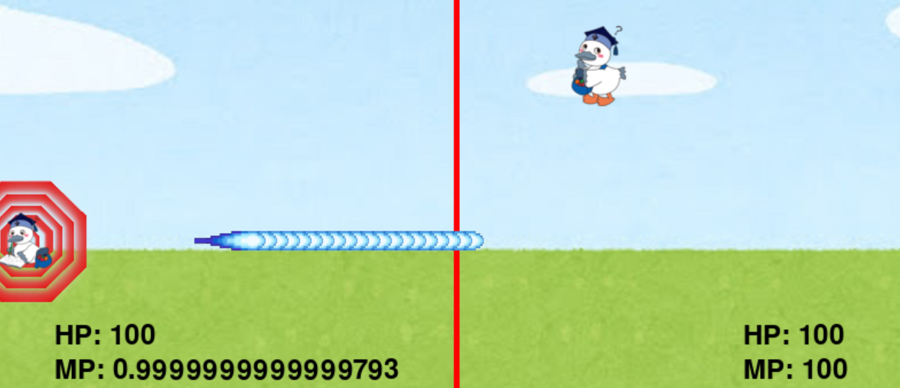

# 戦え、工科トン

## 実行環境の必要条件
* python >= 3.10
* pygame >= 2.1

## ゲームの概要
* 無双工科トンを改良し、PVPができるようにした。

## ゲームの遊び方
* 矢印キーで工科トン１を操作し，wasdキーで工科トン２を操作する。
* right_shiftで工科トン１がビームを打ち、left_shiftで工科トン２がビームを打つ
* HPが０になったらゲーム終了

## ゲームの実装
### 共通基本機能
* 背景画像と主人公キャラクターの描画,工科トン２の実装

### 分担追加機能
* 工科トン同士のビームの当たり判定
* 防御壁の実装
* 残りHP,MPの表示
* トランザム
* EMPの当たり判定の追加
* game終了画面の追加
### ToDo
- [ ] 科トン２の実装
- [ ] 工科トン同士のビーム、EMPの当たり判定の追加
- [ ] 防御壁の実装
- [ ] 残りHP,MPの表示
- [ ] トランザム
- [ ] 

